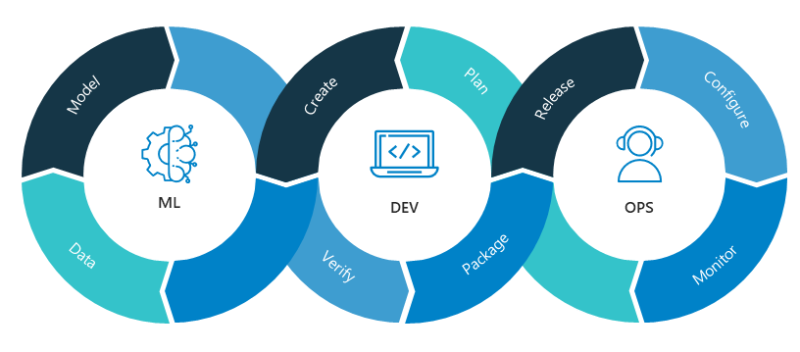

# <h1 align=center> Cohorte Data-FT13 -- Matias Tejerina </h1>

# <h1 align=center> **PROYECTO INDIVIDUAL Nº1** </h1>

# <h1 align=center>**`Machine Learning Operations (MLOps)`**</h1>

# <h1 align=center> **Introducción** </h1>

En este proyecto vamos a adentrarnos en el mundo de las Operaciones de Machine Learning, abordando tres etapas fundamentales: Preparación de datos, exploración y transformación de los datos, y aplicación de técnicas de Machine Learning.

Se trabajara con un dataset de juegos de la plataforma Steam.

En un primer paso, aplicaremos técnicas de preparacion de los datos y crearemos funciones especificas para construir una API a traves de FastAPI y desplegarla en un servidor web de Render, que permita acceder y consultar los datos y funciones de manera sencilla. Crearemos consultas específicas para obtener información como géneros más destacados, juegos lanzados en años concretos y otros detalles relevantes para el análisis de sentimientos y puntuaciones de juegos.

Luego, nos adentraremos en la etapa de exploración y transformación de los datos. Aquí nos encargaremos de limpiar y explorar los datos, preparándolos para futuras predicciones. El Análisis Exploratorio de Datos (AED) resultará esencial para comprender las relaciones entre distintas variables y detectar posibles patrones e irregularidades.

La fase final nos conducirá al núcleo del proyecto que es la creacion del modelo predictivo. Entrenaremos un algoritmo de aprendizaje automático para realizar pronósticos sobre los precios de los juegos en la plataforma Steam a traves de una regresión. Haremos una seleccion de features como género, año y especificaciones técnicas, con el objetivo de mejorar la precision del modelo.

Por otro lado, no nos limitaremos únicamente a la parte técnica; la comunicación de los resultados también es esencial. Generaremos un video que demuestre el funcionamiento de las funciones contenidas en el endpoint de la API.

En este desafiante proyecto, adquiriremos habilidades para enfrentar situaciones del mundo real en el campo de las Operaciones de Aprendizaje Automático. Desde la preparación y análisis de datos hasta la implementación de un modelo predictivo para el precio de un juego de Steam en una API de fácil acceso.

# <h1 align=center> **Diccionario de datos** </h1>

# <h1 align=center> **Links de utilidad** </h1>

➮ Notebook del analisis exploratorio y creacion del modelo de Machine Learning: [Link al Notebook](https://github.com/MatiTejerina/MLOps-PI/blob/master/EDA%20%2B%20ML.ipynb) 
➮ Fuente de datos: [Link al Dataset](https://github.com/MatiTejerina/MLOps-PI/blob/master/steam_games.json)  
➮ Deployment: [Link de Render](https://mlops-steam.onrender.com/docs/)  
➮ Video: [Link al Video]()  

# <h1 align=center> **Desarrollo** </h1>

**`Desarrollo API`**: Se disponibilizan las siguientes funciones de consulta a traves de FastAPI:

+ def **genero( *`Año`: str* )**:
    Se ingresa un año y devuelve un diccionario con los 5 géneros más ofrecidos en el orden correspondiente.

+ def **juegos( *`Año`: str* )**:
    Se ingresa un año y devuelve un diccionario con los juegos lanzados en el año.

+ def **specs( *`Año`: str* )**:
    Se ingresa un año y devuelve un diccionario con los 5 specs que más se repiten en el mismo en el orden correspondiente. 

+ def **earlyacces( *`Año`: str* )**:
    Cantidad de juegos lanzados en un año con early access.

+ def **sentiment( *`Año`: str* )**:
    Según el año de lanzamiento, se devuelve un diccionario con la cantidad de registros que se encuentren categorizados con un análisis de sentimiento. 

+ def **metascore( *`Año`: str* )**:
    Top 5 juegos según año con mayor metascore.

 

**`Deployment`**: Se desplegó la API con Render para poder ser consumida desde la web

 

**`Análisis exploratorio de los datos`**: _(Exploratory Data Analysis-EDA)_

En esta fase del proyecto se crearon y seleccionaron las features que fueron utilizadas en el modelo, se completaron datos faltantes con informacion disponible en otras columnas, se eliminaron los datos que estaban en un formato extraño, se limpiaron los valores nulos, y se realizo one-hot encoding. Por ultimo se hizo un analisis univariable y multivariable para estudiar la distribucion de los datos de cada columna y la relacion entre ellos a traves de graficos, quitando outliers en el camino.

**`Modelo de predicción`**: 

La data es consumible por la API, está lista para ser utilizada por los departamentos de Analytics y Machine Learning, y nuestro EDA nos permite entender bien los datos a los que tenemos acceso. Se entrenó un modelo XGBoost de regresión para predecir la columna 'Price'. Se exportó el modelo como archivo pkl para ser importado en el script que contiene las funciones utilizadas en el main. Los features utilizados son los siguientes (Year: ejemplo-2015, Month: ejemplo-4, Action: ejemplo-1, Adventure: ejemplo-0, Casual: ejemplo-1, Early Access: ejemplo-0, Indie: ejemplo-1, Massively Multiplayer: ejemplo-0, RPG: ejemplo-1, Racing: ejemplo-0, Simulation: ejemplo-1, Sports: ejemplo-0, Strategy: ejemplo-1). El endpoint que disponibiliza el modelo es el siguiente:

+ def **prediction( *`Year, Month, Action, Adventure, Casual, Early Access, Indie, Massively Multiplayer, RPG, Racing, Simulation, Sports, Strategy`* )**:
    Ingresando estos parámetros, deberíamos recibir el precio predicho y **RMSE**.

_________________________________________________________________________________________________________________

<h1>Contribuciones:</h1>

Este proyecto es de código abierto y está abierto a contribuciones y sugerencias. Si desea contribuir, siga las siguientes instrucciones:

Haga un fork del repositorio: Haga una copia del repositorio en su propia cuenta de GitHub.

Cree una nueva rama: Cree una nueva rama en su fork para trabajar en su característica o corrección específica.

Realice sus cambios: Realice los cambios necesarios en la nueva rama, asegurándose de seguir las mejores prácticas de codificación y documentación.

Realice un pull request: Una vez que haya completado sus cambios, envíe un pull request a la rama principal del repositorio original. Espere la revisión y aprobación del equipo.